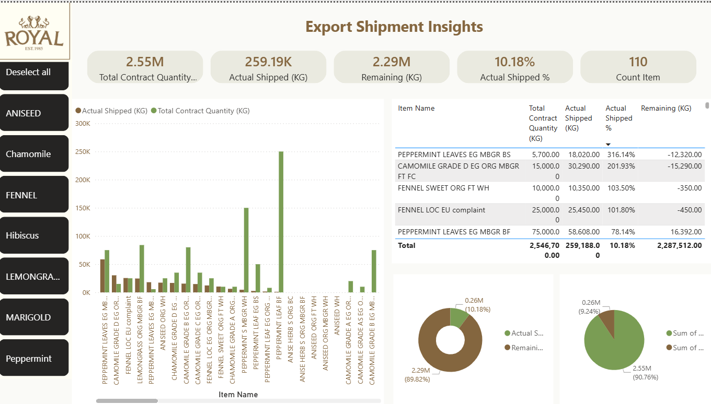

# Export Shipment Analytics - Power BI

## Project Overview

This project focuses on tracking export shipment progress using Power BI.

I built this dashboard to track contracted quantities, actual shipped quantities, and remaining quantities across different products and items. The main purpose is to provide a clear view of shipment progress and make it easier to identify items that are completed, partially shipped, or still pending.

## Dashboard Overview

The dashboard provides an overall view of export shipment performance.

Key metrics include:

- Total Contract Quantity
- Actual Shipped Quantity
- Remaining Quantity
- Actual Shipped %
- Total Number of Items

## Shipment Analysis

The dashboard provides a detailed comparison between contracted and shipped quantities at item level.

The analysis includes:

- Contract quantity by item
- Actual shipped quantity by item
- Remaining quantity
- Actual shipped percentage
- Shipped vs. remaining quantities
- Overall shipment progress

The product filters on the left side allow users to select a specific product category and review its shipment status separately.

## Tools Used

- Power BI
- Power Query
- DAX
- Data Modeling
- Data Cleaning and Transformation
- Data Visualization

## What I Worked On

I prepared and transformed the shipment data, built the required calculations, and designed the dashboard in Power BI.

I created measures to compare actual shipped quantities against contracted quantities and calculate the remaining quantities and shipment completion percentage.

I also designed the product-level filtering and item-level analysis to make shipment tracking easier and more practical.

## Power BI File

The Power BI file used for this project is included in the repository.

[Open Power BI Project](Royal%20Herbs.pbix)
